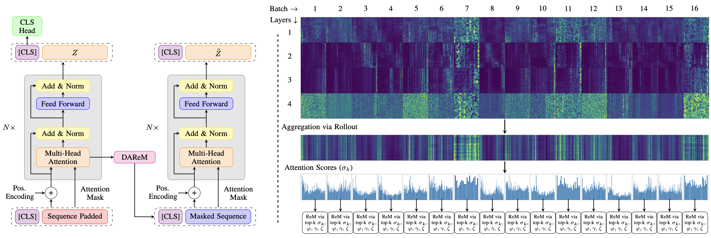
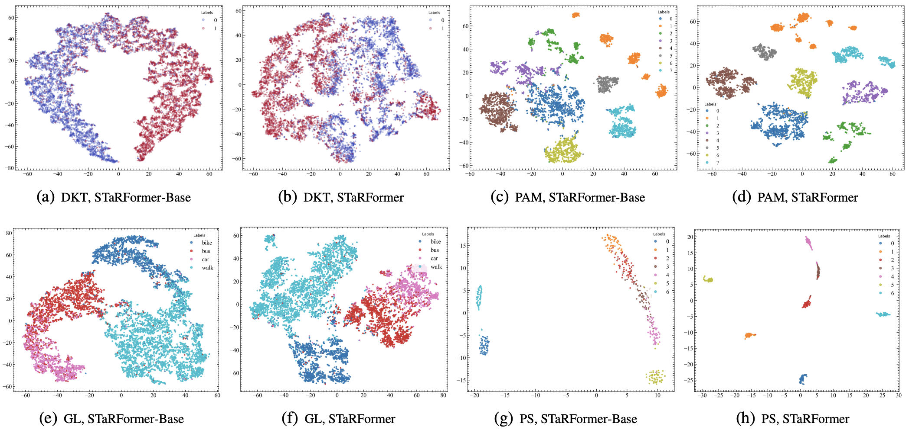

# STaRFormer

This is the old codebase of the official implementation of [[NeurIPS-2025] STaRFormer: Semi-Supervised Task-Informed Representation Learning via Dynamic Attention-Based Regional Masking for Sequential DataSequential Data](https://neurips.cc/virtual/2025/poster/116860).

## 1. Overview
We try to adress real-world scenarios of time-series modelling, where environmental factors and signal measurement limitations result in non-stationary and irregularly sampled data, posing challenges. To
address this, we developed a transformer-based framework designed for sequential data tasks, which also serves as an augmentation mechanism
and can serve as a universal framework for time-series modeling. Our method employs a novel ”dynamic attention-based regional masking”
scheme combined with semi-supervised contrastive learning to enhance task-specific latent representations. We validated our approach on 19 datasets varying in domains, composition, sequence lengths, training samples, and application, demonstrating its efficacy and variability.

### 1.1 Model Architecture


### 1.2 TSNE Latent Embedding Visualization


## 2. Results 

See the [Project Page](https://star-former.github.io/) or go directly to the [Weights&Biases report](https://wandb.ai/mf-uofg/STaRFormer/reports/STaRFormer--VmlldzoxNDY2Njk3OQ?accessToken=qc2v09qzoebzimmuq4qp0lli5ojwsitynu8ep6aucd333fmki6cbxu0r8j8fj28c) for more details.

## 3. Getting Started

### Setup Environment
We provide two `requirements.txt` files, one with requirements for running on Nvidia GPU hardware one that runs for CPU hardware only.

We recommend to use [pyenv](https://github.com/pyenv/pyenv) and [pyenv-virtualenv](https://github.com/pyenv/pyenv-virtualenv) to handle and setup the virtual environment. 

We recommend to use Python 3.10.14, as we have tested all packages to be compatible with Python 3.10.14. Using `pyenv`, install Python 3.10.14.

```
pyenv install 3.10.4
```
Use `pyenv-virtualenv` to create a virtual environment

```
pyenv virtualenv 3.10.14 starformer-py3.10.14
```
Then active the environment 

```
pyenv activate starformer-py3.10.14
```
and install the requirements.

```
pip install -r requirements_py3.10.14.txt
```
or 
```
pip install -r requirements_cuda_py3.10.14.txt
```
for GPU hardware.

## 4. Training
To reproduce the experiments in the paper, you can execute the following.
The default logger is set to tensorbard, adjust to `config` files to use [Weights&Biases](https://wandb.ai/site/) for logging. 
### 4.1. Classification
#### 4.1.1. Geolife, P19, P12, PAM
```
CUDA_VISIBLE_DEVICES=0 python scripts/training/train.py +experiment=benchmark/classification/<dataset>.yaml
```
#### 4.1.2. Datasets from the UCR-UEA Repo
```
CUDA_VISIBLE_DEVICES=0 python scripts/training/train.py +experiment=benchmark/classification/ucr-uea/<dataset>.yaml
```
### 4.2. Anomaly Detection
```
CUDA_VISIBLE_DEVICES=0 python scripts/training/train.py +experiment=benchmark/anomaly/<dataset>.yaml
```
### 4.3. Sweeps
You can also run new sweeps. However, this requires the use of [Weights&Biases](https://wandb.ai/site/) in the current setup.

1. Setup sweeps
```
wandb sweep configs/sweeps/< >.yaml
```

3. Start a sweep agent
```
CUDA_VISIBLE_DEVICES=0 wandb agent <wandb-entity>/<project>/<sweep_id>
```
